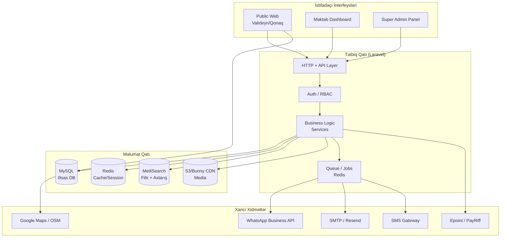
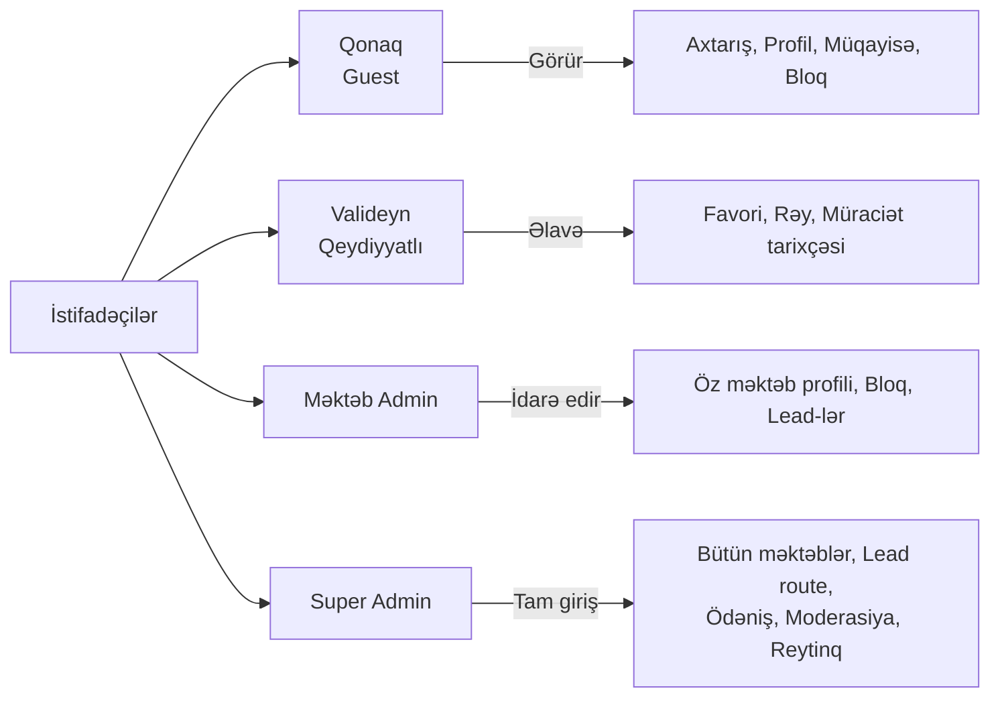
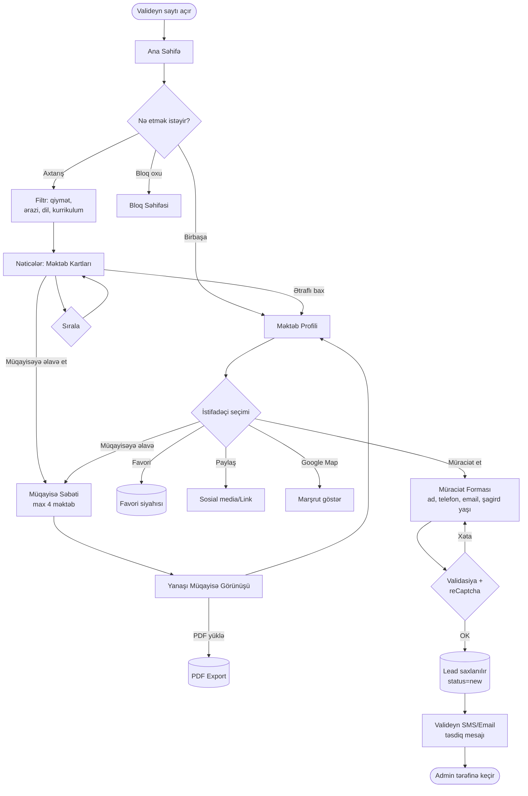
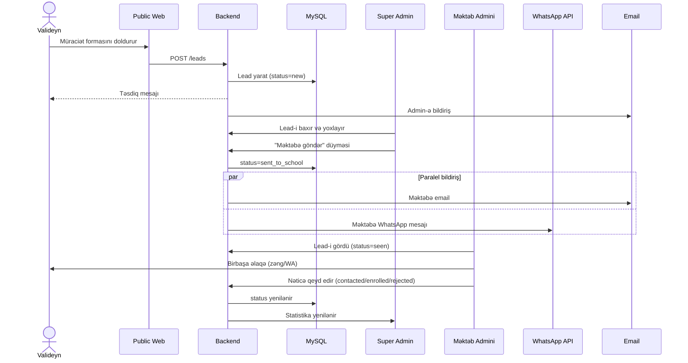
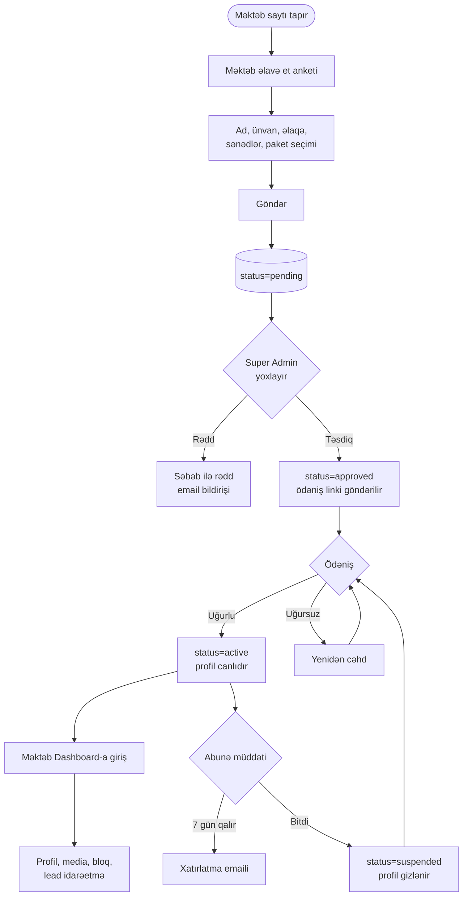
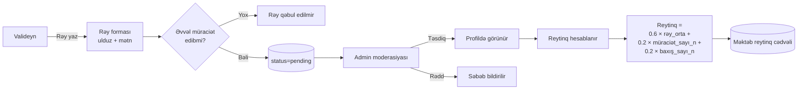
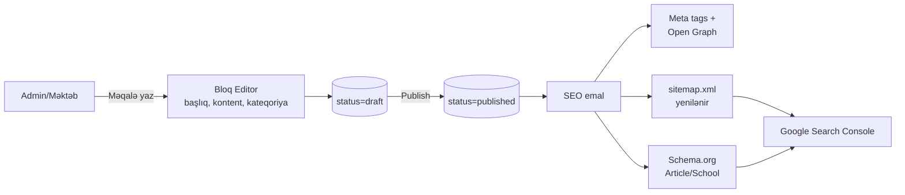

# EduNav.az — Sistem İşləmə Sxemi

> Platformanın ümumi arxitekturası, aktorları və əsas iş axınları.

---

## 1. Ümumi Arxitektura (High-Level)



---

## 2. İstifadəçi Rolları və Hüquq Matrisi



**İcazə qaydaları:**

| Əməliyyat | Qonaq | Valideyn | Məktəb | S.Admin |
|---|:---:|:---:|:---:|:---:|
| Məktəb axtar/bax | ✓ | ✓ | ✓ | ✓ |
| Müqayisə et | ✓ | ✓ | ✓ | ✓ |
| Müraciət göndər | ✓ | ✓ | – | – |
| Rəy yaz | – | ✓ | – | ✓ |
| Öz profilini redaktə | – | – | ✓ | ✓ |
| Lead-i məktəbə göndər | – | – | – | ✓ |
| Rəy moderasiyası | – | – | – | ✓ |
| Paket/ödəniş | – | – | ✓ | ✓ |

---

## 3. Əsas Axın: Valideyn Səyahəti (Parent Journey)



---

## 4. Lead İdarəetmə Axını (Admin → Məktəb)



**Lead status-ları:** `new` → `reviewed` → `sent_to_school` → `seen` → `contacted` → `enrolled` / `rejected`

---

## 5. Məktəb Qeydiyyat və Aktivləşmə Axını



**Paket fərqləri (təklif):**

| Feature | Basic | Standard | Premium |
|---|:---:|:---:|:---:|
| Profil görünürlüyü | ✓ | ✓ | ✓ |
| Foto sayı | 5 | 20 | ∞ |
| Video | – | 1 | ∞ |
| Aylıq lead limiti | 10 | 50 | ∞ |
| Bloq yerləşdirmə | – | ✓ | ✓ |
| Premium Badge | – | – | ✓ |
| Siyahıda önə çıxma | – | – | ✓ |
| Müqayisədə prioritet | – | – | ✓ |

---

## 6. Rəy və Reytinq Axını



---

## 7. Məlumat Modeli (ERD — İlkin Eskiz)

```mermaid
erDiagram
    USER ||--o{ LEAD : submits
    USER ||--o{ REVIEW : writes
    USER ||--o{ FAVORITE : saves
    SCHOOL ||--o{ LEAD : receives
    SCHOOL ||--o{ REVIEW : has
    SCHOOL ||--o{ FAVORITE : appears_in
    SCHOOL ||--o{ MEDIA : has
    SCHOOL ||--o{ BLOG_POST : publishes
    SCHOOL }o--|| PLAN : subscribes
    SCHOOL }o--o{ SERVICE : offers
    SCHOOL }o--o{ INFRASTRUCTURE : has
    SCHOOL }o--o{ ACTIVITY : offers
    SCHOOL }o--o{ LANGUAGE : teaches
    SCHOOL }o--|| CURRICULUM : follows
    SCHOOL }o--|| DISTRICT : located_in
    PLAN ||--o{ PAYMENT : billed
    LEAD ||--o{ LEAD_STATUS_LOG : tracks

    USER {
        id bigint
        name string
        email string
        phone string
        role enum
        email_verified_at ts
    }
    SCHOOL {
        id bigint
        name string
        slug string
        district_id fk
        address string
        lat decimal
        lng decimal
        price_min int
        price_max int
        student_count int
        opened_year int
        plan_id fk
        status enum
        rating decimal
        views_count int
    }
    LEAD {
        id bigint
        user_id fk
        school_id fk
        student_name string
        student_age int
        status enum
        notes text
        created_at ts
    }
    REVIEW {
        id bigint
        user_id fk
        school_id fk
        stars tinyint
        comment text
        status enum
    }
    PLAN {
        id bigint
        name string
        price decimal
        features json
        duration_days int
    }
```

---

## 8. SEO və Bloq Axını



---

## 9. Kritik Qeyri-Funksional Tələblər

| Kateqoriya | Tələb |
|---|---|
| **Performans** | Ana səhifə < 1.5s, filtr nəticəsi < 500ms |
| **SEO** | Lighthouse SEO ≥ 95, Core Web Vitals yaşıl |
| **Mobil** | Mobile-first, 360px-dan test |
| **Dillər** | AZ (əsas), RU, EN |
| **Təhlükəsizlik** | reCaptcha v3, rate-limit, CSRF, XSS qorunması |
| **GDPR/Məxfilik** | Valideyn məlumatları şifrələnmiş, silmə hüququ |
| **Yedək** | Gündəlik DB backup, 30 gün saxlanma |
| **Monitoring** | Sentry (error), Uptime robot, Google Analytics |

---

## 10. Növbəti addımlar

1. Bu sxem üzrə **razılaşma** (nə dəyişmək lazımdır?)
2. **Paket matrisini** dəqiqləşdirmək (qiymət, limitlər)
3. **Tech stack** yekun qərarı (Livewire vs Next.js)
4. **ERD detallaşması** → miqration planı
5. **Wireframe** / səhifə skeletləri
6. **Sprint planı** və task breakdown
